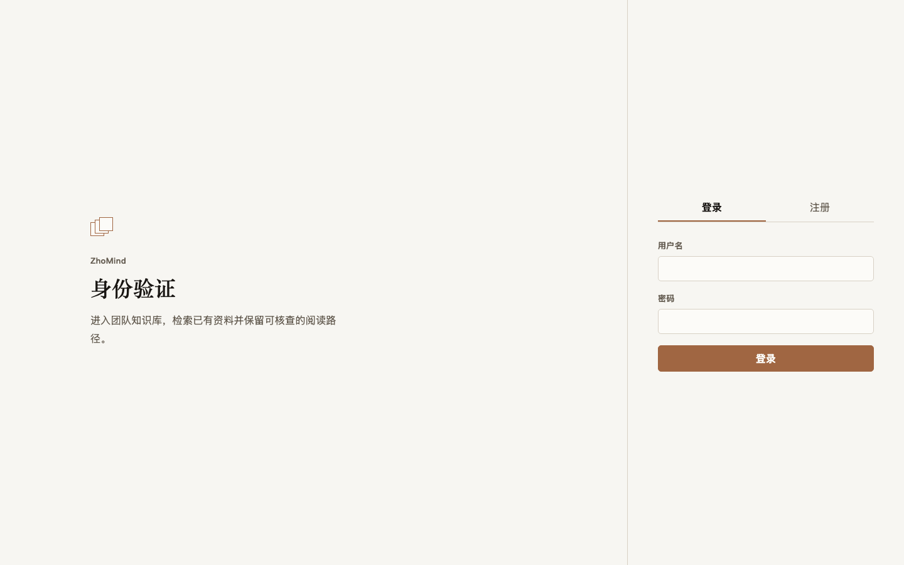

# ZhoMind-v2

[中文说明](README.zh-CN.md) | [Interview Dossier](docs/portfolio/INTERVIEW-DOSSIER.md) | [Release Notes](docs/releases/PORTFOLIO-RELEASE-v1.0.0.md) | [Public Evidence Bundle](public-evidence/releases/portfolio-release-candidate-01/REPORT.md)

ZhoMind-v2 is a first-release, team-shared knowledge-base application for the point at which an answer must be traceable to approved source material. An administrator controls who may join, builds and publishes source generations deliberately, and manages the one approved generation provider. A Knowledge User either receives an Evidence-Gated Answer with an inspectable source summary or an explicit closed outcome. The project does not require a continuously hosted public demo for review.



The screenshot is a bounded static render of the existing Chinese application entry: it uses no private content, credentials, host information, raw diagnostics, or production data.

## Portfolio Release

The accepted runtime source candidate is `91753f1c1ff6fc07bc262dfa50fb719a63210e0b`. Its reviewed, non-sensitive [Public Evidence Bundle](public-evidence/releases/portfolio-release-candidate-01/REPORT.md) is `portfolio-release-candidate-01`; the [manifest](public-evidence/releases/portfolio-release-candidate-01/manifest.json) binds run identities, frozen corpus/query hashes, artifact hashes, and declared limits to that source revision. The release artifact revision is the Git commit that contains this checked bundle and the bilingual release materials; before tagging, it must equal local `main`, the authoritative remote `main`, and the tag target. The source revision must be an ancestor of that artifact revision, because a generated bundle cannot self-reference the hash of the commit that adds it.

The [Interview Dossier](docs/portfolio/INTERVIEW-DOSSIER.md) maps every portfolio claim to a source file, accepted test, or bundle artifact. The [Release Notes](docs/releases/PORTFOLIO-RELEASE-v1.0.0.md) summarize the development sequence and release boundary without requiring a reviewer to reconstruct the commit history.

## User Problem

A source-uploaded knowledge base is not sufficient when source eligibility and answer support must be reviewable. A successful build is not automatically searchable, a broad retrieval diagnostic is not proof that a generated answer was supported, and a provider error must not become an uncited answer.

ZhoMind-v2 makes those transitions explicit. Administrators publish source generations only after inspection. Knowledge Users see source identity and a bounded excerpt for supported answers. When no valid Answer Evidence Set exists, the product returns an Insufficient Evidence Reply without calling a generation provider.

## Architecture

The release keeps five boundaries separate. Their names are intentional because they answer different questions and cannot substitute for one another.

| Boundary | Purpose | It does not prove |
| --- | --- | --- |
| Migration Retrieval | Availability behavior while dense coverage or dense query availability is incomplete; it can fall back to the existing Lexical Heuristic. | Quality-oriented Sparse BM25 or Hybrid Retrieval quality. |
| Evaluation Retriever | Experiment-only comparison over one frozen Project-Derived Corpus and Evaluation Query Set. It evaluates `sparse_bm25`, `dense`, and `hybrid_rrf`. | Production routing or an answer being supportable. |
| Direct Retrieval Diagnostic | Administrator retrieval-health surface that can expose a broader ordered candidate set. | Citation selection, Answer Evidence Set membership, or a production answer path. |
| Evidence-Gated Answer Execution | One transport-independent execution boundary that selects the closed Answer Execution Outcome. | That a diagnostic candidate may be cited or that a provider may answer without evidence. |
| Production Answer Acceptance | Authenticated `/chat` acceptance over normal, SSE, and history projections. | A direct retrieval result alone. |

The public architecture is therefore a product flow, not a feature list:

```text
Candidate Build -> explicit Published Knowledge Version -> retrieval
                                                     -> Answer Evidence Set
                                                     -> Evidence-Gated Answer Execution
                                                     -> normal, SSE, and history projections
```

The documented production checks assert the final user-facing path, while the Evaluation Retriever and Direct Retrieval Diagnostic remain separate evidence surfaces.

## Evidence-Gated Answer

Evidence-Gated Answer Execution forms one immutable Answer Evidence Set from final retrieval order. Under the first-release policy it supplies at most the first three valid passages to the Approved Generation Provider, and each item carries one immutable Evidence Excerpt Snapshot. The prompt, persisted citation, normal response, SSE response, and history projection refer to that same set and snapshot.

The closed outcomes preserve fail-closed behavior:

- `evidence_gated_answer` requires a non-empty Answer Evidence Set from a Published Knowledge Version and exposes title, version or publication time, and an openable relevant excerpt.
- `insufficient_evidence_reply` has no citation and invokes no generation provider.
- `generation_unavailable` has no generation fallback route when the Approved Generation Provider is unavailable.
- `non_knowledge_base_reply` is a narrow pre-retrieval exception for allowlisted social prompts, not an uncited knowledge answer.

This is the release's central invariant: the Direct Retrieval Diagnostic may contain broader candidates, but it never selects or repairs the Answer Evidence Set.

## Publication Lifecycle

The first release uses a Manual Publication Workflow. An administrator uploads or replaces material, starts a build, inspects the Candidate Build, and explicitly publishes the approved generation. Only a Published Knowledge Version may contribute to future retrieval and citations. Withdrawal immediately removes that source from future retrieval; historical projections retain identity and a withdrawal notice rather than continuing to reveal the prior excerpt.

The team model is intentionally narrow: one Team-Shared Knowledge Base, invitation-gated Knowledge User admission, Bootstrap Administrator setup, administrator promotion, and deactivation rather than immediate account deletion. It is not a private-document vault or document-level access-control system.

## Evaluation Method

The [evaluation inputs](evaluation/README.md) freeze a Chinese-first Project-Derived Corpus and 16-query Evaluation Query Set: four exact-constraint, four semantic-paraphrase, four combined-condition, and four Boundary Query cases. Answerable queries measure `Evidence Recall@3/@5/@10`, `Context Precision@3/@5/@10`, first Gold Evidence rank, and retrieval duration. Boundary Query diagnostics stay outside answerable-query aggregates.

The accepted comparison keeps corpus hash, query-set hash, QA Chunking 500/50, output depth 20, and model identity aligned across Sparse BM25, Dense, and Hybrid RRF. Hybrid RRF deduplicates by `chunk_id` and uses rank-only `k=60`; it adds neither score averaging nor reranking. In the recorded run, all three modes had the same recall and context-precision values, while Dense and Hybrid RRF incurred more retrieval duration. This one recorded result does not establish a universal winner and does not relabel Migration Retrieval.

## Security Boundary

Published source content is treated as untrusted data. Evidence-Gated Answer Execution places system policy, the normalized user question, and immutable Evidence Excerpt Snapshots into separate structured regions; provider-visible data excludes credentials, runtime configuration, private history, and administrator diagnostics.

The accepted bounded Prompt Injection observation covers instruction override, configuration or secret extraction, forged-source instructions, and pressure to answer without evidence. Its public record contains only normalized case identity, pass/fail, closed outcome, citation count, and failure classification. It is evidence for the recorded cases and conditions, not a general security guarantee.

## Production Acceptance

The accepted candidate's persistent-stack acceptance records passed authenticated normal answer, SSE, history, insufficient evidence, generation unavailable with zero fallback hops, withdrawal, deactivation, service health, two clean-start Retrieval Smokes, and Administrator/Knowledge User browser role boundaries. The supporting public section is [production acceptance](public-evidence/releases/portfolio-release-candidate-01/sections/production-acceptance.json); it intentionally contains bounded outcomes rather than conversations, prompts, source excerpts, or operations data.

The deterministic PR Gate is reproducible without provider credentials. The accepted remote run recorded backend Ruff, Pyright, and `355 passed, 1 skipped`; frontend unit tests plus production build; and disposable-API browser acceptance `49/49`. The live-Milvus test is explicit opt-in and is never represented as live evidence when skipped.

## Performance And Limits

Performance is an observation, not a service-level claim. The accepted 20-request runs reported zero errors at c1 and c5. c1 total P95 was 15.930 seconds and c5 total P95 was 74.465 seconds; the P95 target of 12 seconds remains unmet. Generation-provider and embedding-provider durations are reported separately from project-controlled timing, whose observed 40-sample regression envelope has a 6128.299 ms threshold.

Results apply only to the recorded corpus, query set, model identity, load, host envelope, and observation window. The release also has explicit first-release capacity boundaries: 25 active members, five concurrent Q&A requests, 500 published knowledge versions/documents, 25 MiB uploads, and one document-build worker. Reaching a boundary requires an explicit scale-up or archive action.

## Local Reproduction

The public deterministic gate uses committed locks and does not require provider credentials, a persistent service, or private host access:

```bash
cd backend
uv sync --frozen
uv run ruff check .
uv run pyright
uv run pytest -q -ra

cd ../frontend
npm ci
npm run test:unit
npm run build
npx playwright install chromium
npm run test:browser

cd ..
python3 scripts/check-docs-parity.py
python3 scripts/validate-evidence-bundle.py --all
python3 scripts/scan-secrets.py
python3 scripts/verify-portfolio-release.py --expected-source-revision 91753f1c1ff6fc07bc262dfa50fb719a63210e0b --expected-release-revision HEAD
```

Real embedding, Milvus, provider, Compose, and persistent-stack acceptance are deliberately separate remote-only checks. Review [the Public Evidence Bundle](public-evidence/releases/portfolio-release-candidate-01/REPORT.md) for its recorded conditions and limits rather than treating a local deterministic run as live-provider or production evidence.
